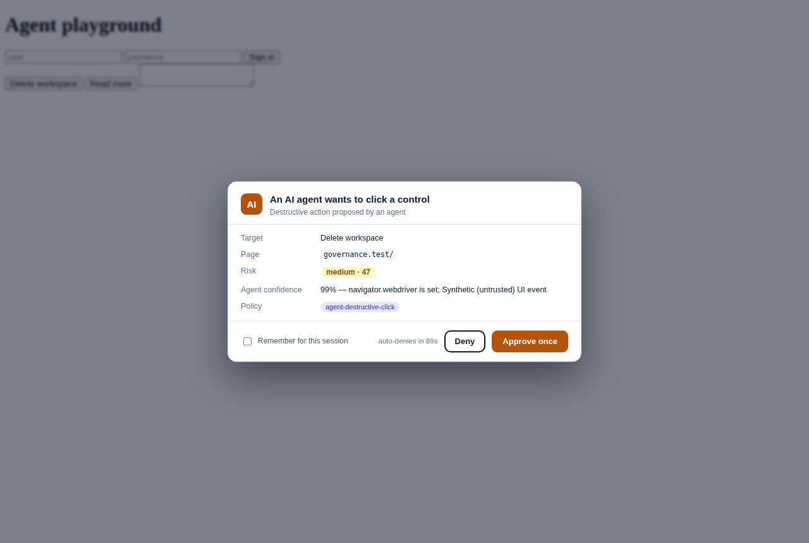
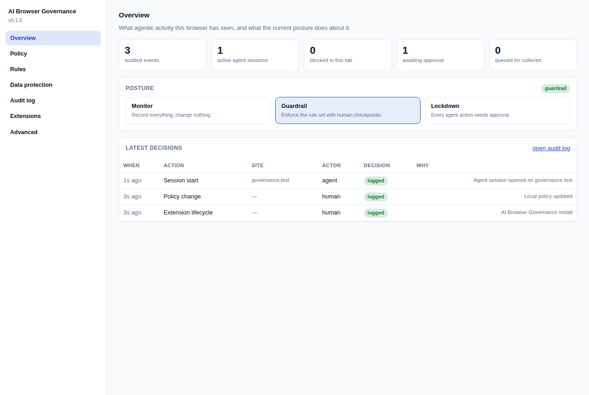
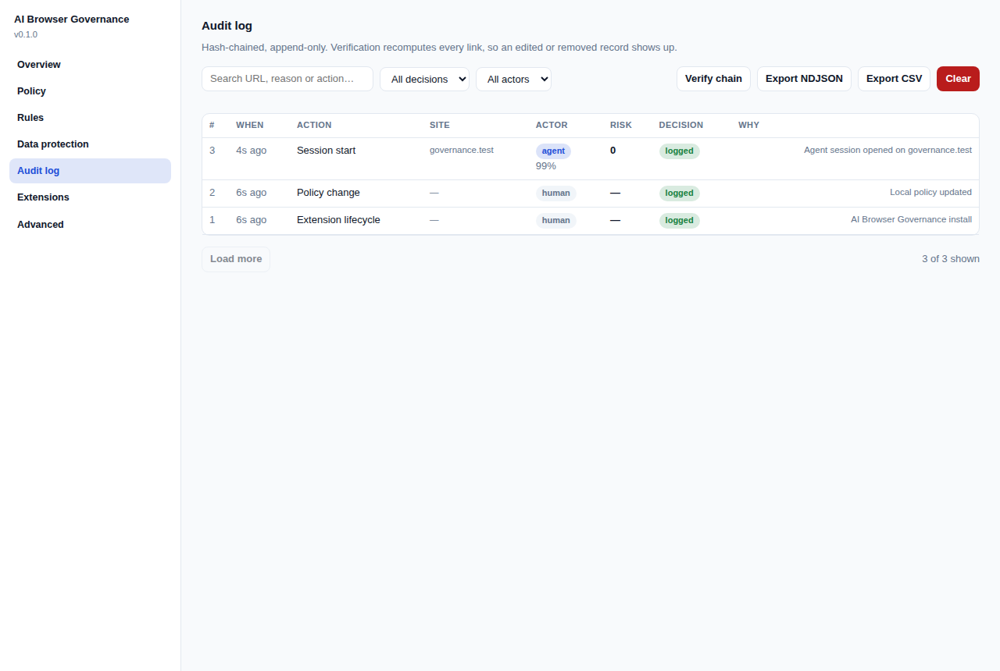

# AI Browser Governance

[](https://github.com/Jaspreet84/AI-Browser-Governance/actions/workflows/ci.yml)
[](https://github.com/Jaspreet84/AI-Browser-Governance/actions/workflows/smoke.yml)

A Chrome extension that gives you visibility and control over **AI agents acting inside your browser**.

Agentic browsing — Claude in Chrome, ChatGPT Atlas/Operator, Gemini, Copilot, browser-use and
Playwright-driven scripts, and the growing pile of "AI assistant" extensions — moves the security
boundary. The question stops being *which sites may this browser reach* and becomes *which actions
may software take while wearing this person's session*. This extension answers that question with
four things:

1. **Detection** — behavioural and environmental signals that distinguish a human hand from a driver.
2. **Policy** — declarative rules over actions, sites, targets and data sensitivity.
3. **Human-in-the-loop** — an approval prompt that only a real key press or mouse click can answer.
4. **Evidence** — a hash-chained, append-only audit log you can export and verify.

It is built to be reviewable: all governance logic lives in dependency-free ES modules under
`src/core/`, and is covered by a test suite that runs under plain Node.



*An agent-driven click on a destructive control, held for a human. Only a trusted event can answer it.*

---

## Install (unpacked)

```bash
git clone <this repo>
cd AI-Browser-Governance
npm test          # optional: 95 tests, no dependencies
```

1. Open `chrome://extensions`
2. Enable **Developer mode**
3. **Load unpacked** → select the repository root
4. Pin the extension; open the popup for the tab view and **Console** for everything else

No build step. The repository *is* the extension.

| | |
| --- | --- |
|  |  |

## The three postures

| Mode | What it does | Use it when |
| --- | --- | --- |
| **Monitor** | Records everything, changes nothing. Every decision is logged with the enforcement it *would* have applied (`wouldHaveBeen`). | You are measuring agent activity before writing policy. |
| **Guardrail** (default) | Enforces the rule set: warns, asks a human, or blocks. | Day-to-day. |
| **Lockdown** | Every agent-attributed action needs explicit human approval. | Incident response, or high-risk work. |

The popup also has a **kill switch**: one click blocks every agent-attributed action in every tab
until you release it, independent of policy.

## How agent detection works

No single browser signal proves "an AI agent did this" — `isTrusted: false` also describes a jQuery
plugin, and `navigator.webdriver` also describes a QA suite. So signals are fused with weights and
time decay into a confidence score (`src/core/agent-signals.js`), and policy decides what confidence
is worth acting on.

| Signal | Weight | Source |
| --- | --- | --- |
| `navigator.webdriver` set | 0.90 | MAIN-world probe |
| DevTools-protocol artifacts (`$cdc_…`) | 0.85 | MAIN-world probe |
| Automation globals (`__playwright`, `__puppeteer`, `__stagehand`, …) | 0.80 | MAIN-world probe |
| Synthetic (untrusted) UI event | 0.75 | isolated sensor |
| Request initiated by an extension | 0.70 | `webRequest` initiator |
| `element.click()` / `form.submit()` from script | 0.60 | patched DOM APIs |
| `input.value` written with no keystrokes | 0.55 | patched value setter |
| Model-provider API traffic from the page | 0.50 | patched `fetch`/XHR |
| Keystroke cadence outside human range | 0.50 | isolated sensor |
| Headless fingerprint | 0.40 | MAIN-world probe |
| Click with no preceding pointer movement | 0.35 | isolated sensor |
| *Trusted human input moments ago* | −0.55 | isolated sensor |

Environment signals do not decay within a session; behavioural ones halve every 20–60 seconds.
Recent human input **discounts** agent evidence rather than cancelling it, because an agent can act
in a tab a human was just using.

## What gets governed

Sensors emit a normalised action, the service worker scores it, and the policy engine returns one of
`allow` / `log` / `warn` / `require_approval` / `block`.

- `element.click` — including clicks on destructive ("delete", "revoke"), financial ("pay",
  "transfer") and sharing controls
- `input.fill` — including direct `.value` writes that fire no events
- `form.submit` — with cross-origin destination detection and form-content scanning
- `file.upload` / `file.download`
- `clipboard.read` / `clipboard.write`
- `page.navigate`
- `ai.prompt_submit` — text about to be sent to a model provider, scanned *before* it leaves
- `network.ai_egress` — model API calls from any tab **or any other extension**, with request-body
  prompt extraction
- `extension.inventory` — installed extensions scored for agentic capability

### Data protection

Eighteen built-in detectors (cloud keys, provider API keys, PEM blocks, JWTs, payment cards with a
Luhn check, IBANs with a mod-97 check, SSNs, internal hosts, PII) plus admin-defined regexes. Scanning
happens in the service worker, so page script never sees the detector set and cannot tune payloads
against it. **Findings never contain the matched secret** — only a redacted preview, a count and a
severity — because the audit log is a long-lived artifact.

### Human-in-the-loop

When policy says `require_approval`, the page renders a modal in a closed shadow root and the action
is held. The load-bearing rule: **only trusted events can approve**. A synthetic click on the Approve
button is refused, surfaced to the human, *and recorded as its own finding* — otherwise the agent
being governed could approve its own action.

Approvals time out (60s by default) and fail closed. An unattended machine denies rather than waits.

## Audit log

Every decision is sealed with SHA-256 over the record plus the previous record's hash. Editing or
removing a record in the middle of the chain breaks verification at exactly that point, which is what
makes the log evidence rather than a debug console.

- **Verify chain** in the console recomputes every link
- Export as **NDJSON** (SIEM-friendly, hashes included) or **CSV**
- Optional forwarding to a collector in batches; a dead collector never blocks a decision or an
  enforcement action
- Retention by age and count, pruned in whole chunks so the surviving window stays verifiable
- Clearing the log is itself an audited event that records how many records were destroyed

## Enterprise deployment

Policy layers, in increasing authority: **shipped defaults → local (user) → managed (admin)**. Set
`locked: true` in the managed layer and local edits are ignored entirely; the console greys out what
the administrator controls.

Push policy through Chrome Enterprise (`3rdparty` → `extensions` → *extension id* → `policy`). The
schema is `managed-schema.json`; a filled-in example is `enterprise/managed-policy-template.json`.

## Permissions, and why each one is needed

| Permission | Why |
| --- | --- |
| `storage` | Policy, audit log, session state, extension inventory. |
| `tabs` | Attribute actions to a tab and render approval prompts in the right frame. |
| `alarms` | Session reaping, audit forwarding, hourly inventory refresh. |
| `scripting` | Re-inject sensors into tabs that were open before install. |
| `notifications` | Tell you about a block or an approval request when no page can prompt. |
| `webRequest` | *Observe* model-provider egress and attribute it to a tab or an extension. MV3 makes this observation-only. |
| `webNavigation` | Record agent-driven navigations and end sessions on tab changes. |
| `declarativeNetRequest` | Network-layer blocking of denylisted hosts, and of model APIs in lockdown — the only way to stop traffic from *other* extensions. |
| `declarativeNetRequestFeedback` | Report which rule matched, for the audit trail. |
| `management` | Inventory installed extensions and score their agentic capability; disable one on request. |
| `downloads` | Attribute downloads started during an agent session. |
| `<all_urls>` host access | Governance that only covers some sites is not governance. Nothing is sent off-device unless you configure a collector. |

**The extension makes no network requests of its own** unless audit forwarding is explicitly enabled
and pointed at a URL you supply.

## Repository layout

```
manifest.json              MV3 manifest
managed-schema.json        Chrome Enterprise policy schema
src/core/                  dependency-free governance logic (all of it unit tested)
  constants.js             shared vocabulary: decisions, actions, signals, severities
  agent-signals.js         weighted, decaying signal fusion -> actor verdict
  dlp.js                   detectors, Luhn/IBAN validation, redaction
  risk.js                  0-100 risk scoring with explainable factors
  sites.js                 site classification (AI provider / sensitive / allow / deny)
  policy-engine.js         evaluate(action, policy, context) -> decision  [pure]
  default-policy.js        the policy shipped with the extension
  policy-resolve.js        default <- local <- managed layering
  audit-log.js             hash-chained append-only log
  session.js               per-tab agent sessions and budgets
src/background/            service worker: decision point, egress watch, inventory, approvals
src/content/               probe.js (MAIN world), sensor.js (isolated), overlay.js (approval UI)
src/ui/                    popup and admin console
tests/                     node:test suite, no dependencies
docs/                      threat model, policy authoring guide, compliance mapping
```

## Development

```bash
npm test        # unit + structural tests (95 tests, no dependencies)
npm run lint    # syntax parse + project conventions
npm run check   # lint + tests
npm run icons   # regenerate assets/icons/*.png from tools/make-icons.js
npm run package # build dist/ai-browser-governance-<version>.zip
npm run smoke   # load the extension in Chromium and drive it like an agent
```

`npm run smoke` needs Playwright and a display (`xvfb-run -a npm run smoke` on a
headless box). It loads the unpacked extension, scripts a destructive click and a
credential write on a fixture page, then asserts the approval prompt appeared, the
write was refused, the secret never reached the log, and the hash chain verifies.

### Continuous integration

Two workflows under `.github/workflows/` run on every push and pull request:

| Workflow | What it runs | Dependencies installed |
| --- | --- | --- |
| `ci.yml` | `npm run lint` and `npm test` on Node 20 and 22, then builds and uploads the packaged zip | none — the unit suite has zero dependencies by design |
| `smoke.yml` | `npm run smoke` under Xvfb, driving the real extension in Chromium | Playwright, installed transiently (`npm install --no-save`) so it never becomes a project dependency |

Both are safe to run locally with the same commands shown above; CI does nothing
a contributor cannot reproduce on their own machine.

## Known limits

Stated plainly, because a governance tool that oversells itself is worse than none:

- **Detection is evidential, not proof.** A determined agent that only produces trusted-looking
  input — a native CDP driver synthesising trusted events, or a human-in-the-loop hybrid — can stay
  under the threshold. This raises the cost of *ungoverned* automation; it is not an anti-bot system.
- **Enforcement replays actions.** A cancelled-then-approved click is replayed programmatically, so
  page behaviour that requires a genuinely trusted event (opening a file picker, some popups) will
  not survive the round trip. Those actions are blocked rather than silently degraded.
- **A window exists at `document_start`.** The sensor does not enforce until the service worker
  answers with a policy snapshot (usually a few milliseconds). Actions before that are recorded, not
  enforced.
- **Another extension with `debugger` outranks this one.** It can drive pages through CDP without
  touching the DOM APIs we watch. That is why the inventory scores such extensions and why lockdown
  can block model APIs at the network layer.
- **Prompt interception is best-effort on rich composers.** Blocking is reliable; replaying an
  approved prompt into a framework-controlled editor is not always.

## Licence

Apache-2.0.
